## 计算机体系结构

------

### 第一讲 概述：从集成电路到数据中心

- 计算机架构：设计、分析、选择和互连硬件部件以制造出满足功能、性能和成本目标的计算机的科学和艺术
- IC (integrated circuit) 集成电路
- 最早的电子通用计算机：ENIAC，by 1946
- 晶体管：替代笨重的真空管和机械继电器，现代计算机的基础

* VLSI (Very Large Scale Integration)：超大规模集成电路

* 抽象层级：Application - Software system - Hardware system - Module - Gates - Circuits - Devices - Physics

* 名词：Silicon Ingot 硅锭，Wafer 晶片,  Naked Die 裸模,  Packaged Die 组合模具

* 半导体：N型（自由电子），P型（空穴）

* 晶体管结构：**nMOS晶体管在栅极为低电平时OFF，高电平时ON；pMOS晶体管在栅极低电平时ON，高电平时OFF**

  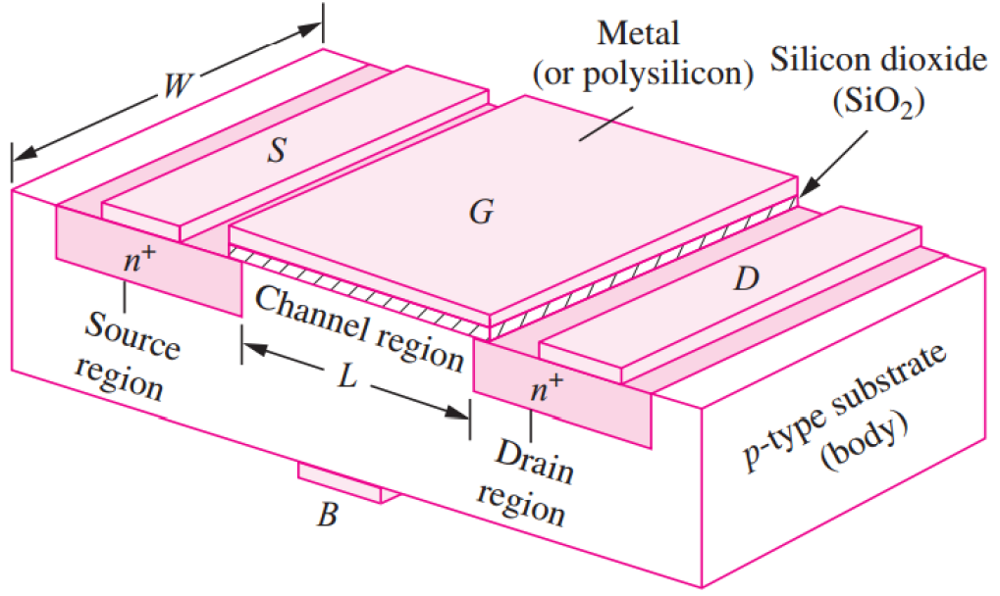

* 晶体管Gate宽度：Gate Length = 2λ，**feature size**

  

* 摩尔定律：当价格不变时，集成电路上可容纳的元器件的数目，约每隔18-24个月便会增加一倍，性能也将提升一倍

* Scale out ：横向扩展，往系统中添加更多组件（eg，增加集群中的结点数）

* Scale Up ：纵向扩展，往系统中的单一组件添加更多资源（eg，提升内存）

* HPC Center/supercomputer，高性能计算中心 ：高性能组件，**注重吞吐量 throughput**

* IDC(Internet Data Centers)，互联网数据中心：价格低廉，商用组件，**注重服务延迟 latency**

* 一个典型的数据中心

  名词：Server racks 服务器机架, A/C systems 空调系统, Power Distribution Units 配电单元, UPS(Uninterruptible Power System) 不间断电源, Energy Storage Cabinets 储能柜, Switch Gears 开关齿轮

  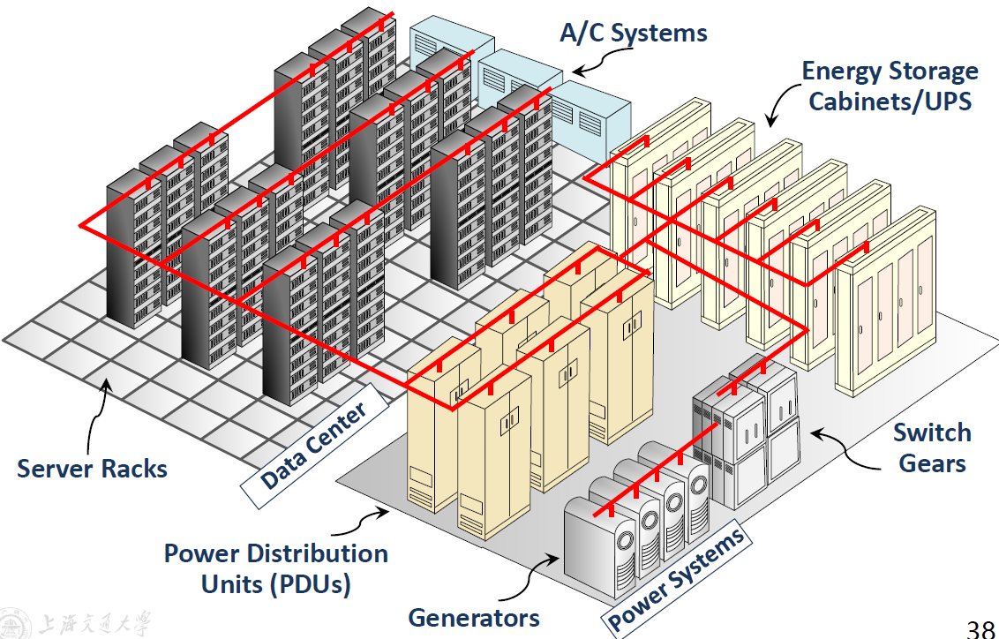

* 数据中心的三大支柱：power system, cooling facility, ICT Equipment (Information and Communication Technology，信息和通信技术)

* 数据中心TCO (Total Cost of Ownership) 总拥有成本：

  CapEX (Capital Expenditure) 资本支出 + OpEx (Operational Expenditure) 运营支出

* Summary

  * What is Computer Architecture
  * History of IC
  * Transistor basics
  * Feature length
  * HPC vs IDC
  * Scale up/out
  * Energy/power issues
  * The trend of Computer Architecture research

* 

------

### 第二讲 指令集架构

* Review

  * ENIAC：使用十进制，每个数字10个真空管，可以存储20个10位数字
  * 从晶体管到集成电路；从单体服务器到数据中心
  * 制造过程 (fabrication process) 的feature size：晶体管的最小横向维度
  * 可扩展性问题 (scale out/up)：指数增长的计算 vs 飞速增长的能源需求

* 计算机设计的层次 aspects

  * 架构 architecture：指令集架构 - instruction set architecture
  * 实现 implementation：微架构 - micro-architecture
  * 物理层设计 physical design：chip realization

* 指令集架构

  * 定义：defines data and control flow
    * 保存数据的存储资源：memory，addressing
    * 转换数据的指令：arithmetic/logic，floating point
  *  另一种定义：defines set of programmer visible state (程序员可见状态集)，instruction format and semantics (指令格式和语义)

* 计算机架构的发展史

  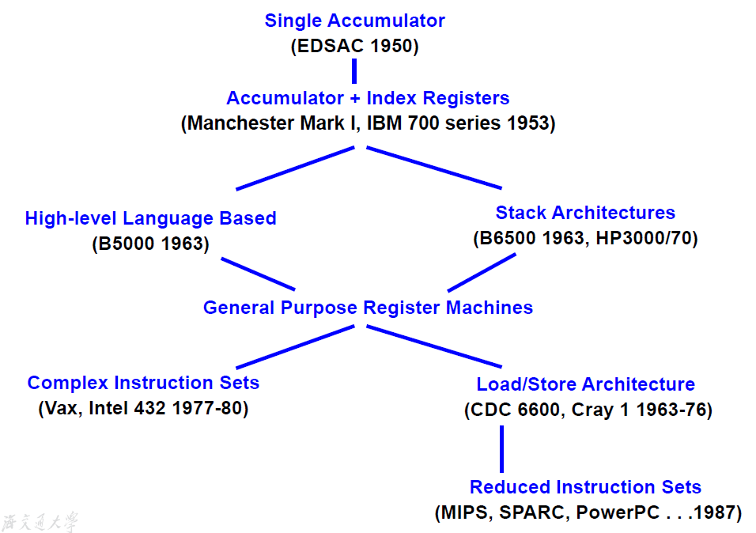

* **四种传统的架构：stack，accumulator（直接操作内存），register-memory（CISC），register-oriented（RISC）**

  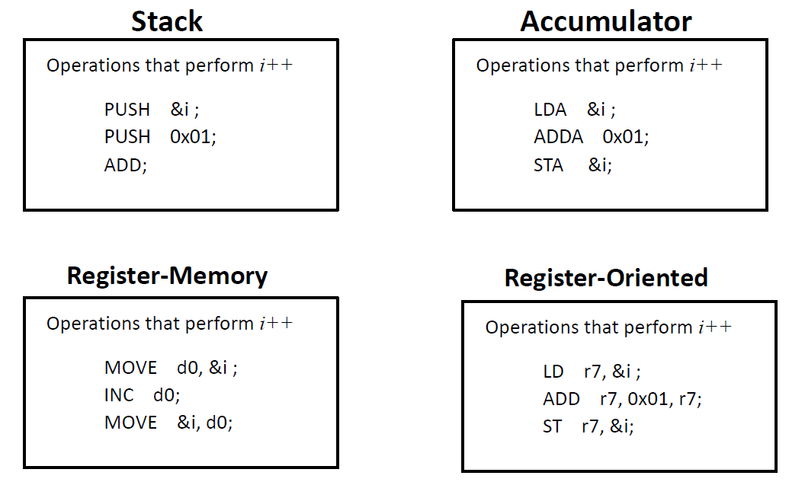

* 复杂指令集 CISC

  * **80**年代中期的主导风格
  * 编译器容易实现，更少的代码
  * **stack-oriented instruction set**
    * 通过栈传递参数，保存程序计数器 IP
    * 显示地push/pop指令
  * **register-memory architecture**
    * 算术指令可以访问内存
  * **condition codes**：设置为算术和逻辑指令的副作用 side effect

* 采用CISC的处理器

  * IA-32：Intel Architecture， 32 bit
    * IA-32 registers：Program registers(eax, ecx, edx, ebx, esi, edi, esp, ebp),  condition codes, PC(eip), Memory
    * Processor State：为下一条指令提供上下文而在指令末尾保存在处理器中的信息
    * Processor Power State
  * X86-64： x86 instruction set, 64 bit
  * IA-64：一个完全新的高性能指令集架构，安腾系列的的Intel 64位微处理器

* 精简指令集 RISC

  - 现代的RISC可以追溯到1980s
  - 更少，更简单的指令
    - 完成相同的task需要更多的指令
    - 可以在small/fast的硬件上执行
  - **register-oriented instruction set**
    - 有许多提供给参数，返回值的寄存器（32个）
  - **load-store architecture**
    - 只有load/store指令可以访问内存
  - **no condition codes**

* 采用RISC的处理器：MIPS

  * 全拼：Microprocessor without Interlocked Pipeline Stages
  * 指令类型：R类型，I类型，J类型

  

  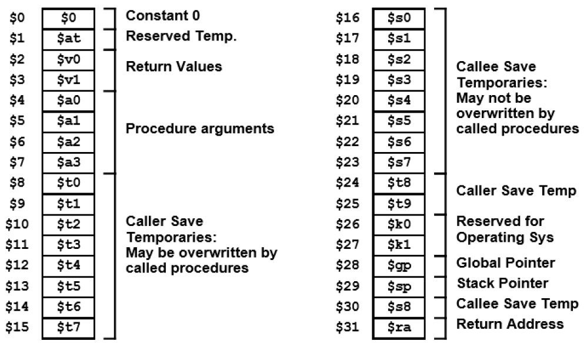

* 指令集是硬件软件直接的接口

  * 高级程序语言 high level language - 汇编程序 low level language 指令集 ISA - 数据通路 register level transfer - 逻辑门电路 - CMOS 晶体管

  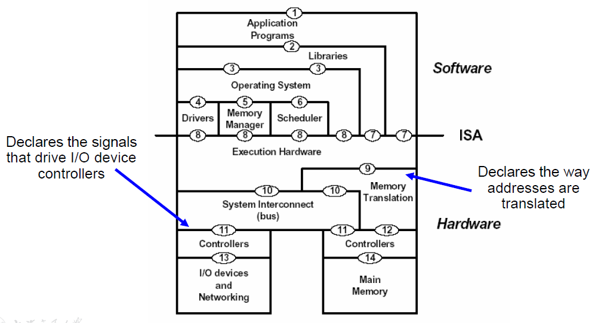

  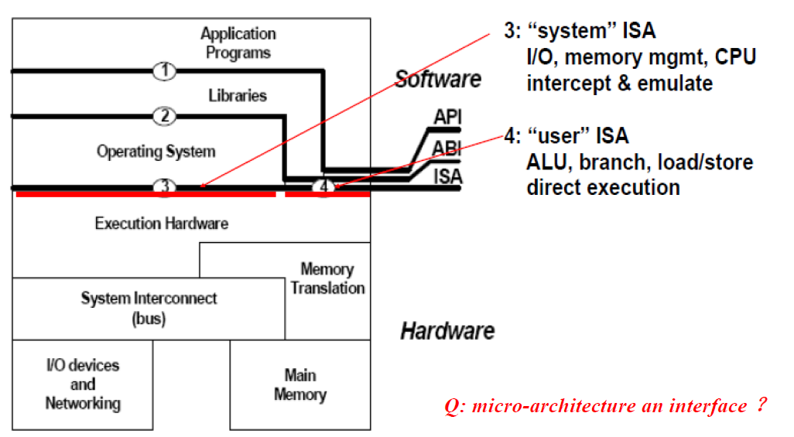

* User ISA 和 System ISA

  * **User ISA：使应用程序正常工作**

    * 这是编译器在将高级语言中指定的算法映射到机器指令时所使用的ISA的子集
    * 指代那些对应用程序可见的指令集：data flow，ALU operations， control flow

    

  * **System ISA：管理/共享资源**

    * 这是为低级O/S子系统用汇编语言精心编写的ISA的子集（eg. scheduler, virtual memory, device drivers）
    * 指代那些助管软件可见的指令集，比如OS，用于管理硬件资源

    

* 优秀的指令集的特点 Good interface design

  * 背景：更大的CPU，技术瓶颈改变(power)，编译技术进步 (寄存器分配)，程序风格改变 (汇编，面向对象)，应用程序改变 (多媒体，深度学习)
  * 兼容性：具有多种实现
  * 普遍性：在多种场景使用
  * 提供到higher level的方便功能
  * 允许在lower level做有效的实现

* 组合逻辑和时序逻辑

  * 边缘触发：数据仅在clock edge被采样

* 哈佛架构 Harvard Architecture

  * 将指令和数据的存储和信号通路物理层面地分开

  

* 五级流水线：指令级并行

  * 阶段：Instruction fetch -> Instruction decode and Register file Read -> Execute or Address calculation -> Memory access -> Write back

  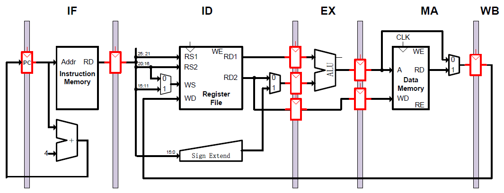

* **理想的流水线**

  * 一致的子过程划分 - 平衡pipeline状态 
    * **Uniform sub-computations - balancing pipeline states**
  * 相同的计算 - 统一的指令类型 
    * **Identical computations - unifying instruction types**
  * 独立的计算过程 - 最小化pipeline暂停 
    * **Independent computations  - minimizing pipeline stalls**

* 阶段量化 Stage Quantization

  * 将一些子过程合并：更短的stage间延迟
  * 将一些子过程拆分：子过程的更细粒度

  

* **流水线部件 pipeline slots**

  * **分类：front-end, back-end, retiring, bad speculation**
  * 前端表示处理器核心的第一部分，后端负责获取后面执行的操作
    * 分支预测：预测下一条执行指令的地址
    * cache lines：获取和解析指令
    * 解析成微指令 uOps
  * 前端绑定metric, 表示处理器前端对后端的slot fraction供应不足

* Summay

  * Architecture vs microarchitecture
  * Evolution of instruction sets
  * CISC(IA32) vs RISC(MIPS)
  * Machine interfaces
  * User/System ISA
  * MIPS instruction field
  * Single-cycle MIPS
  * Ideal pipeline
  * Stage quantization
  * Pipeline slot

------

### 第三讲 指令级并行化探索 I

* Review

  * ISA, micro-architecture, physical design
  * Evolution of ISA
  * CISC vs RISC, IA32 and x86
  * MIPS instruction fields
  * Machine interface, user ISA and system ISA
  * Good interface design
  * Hardware elements
  * Simple MIPS pipeline
  * Pipeline speedup and pipeline design challenge

* Dependence and Hazards

  * 依赖关系的定义：反应程序的执行顺序，暗示存在hazard的可能性，决定了parallel的程度

  * Hazard：由乱序指令，重叠执行等引起

  * 三种依赖：

    * **data dependence**：easy for determine for registers, hard for memory location

      eg.  c = a + b; e = c + d;

    * **name dependence**

      **anti-dependence** : eg. a = b + c; b = c + d;

      **output dependence**：eg. a = b + c; a = d + e;

    * **control dependence**：分支语句

  * 可能的数据冒险类型：RAW, WAR, WAW

    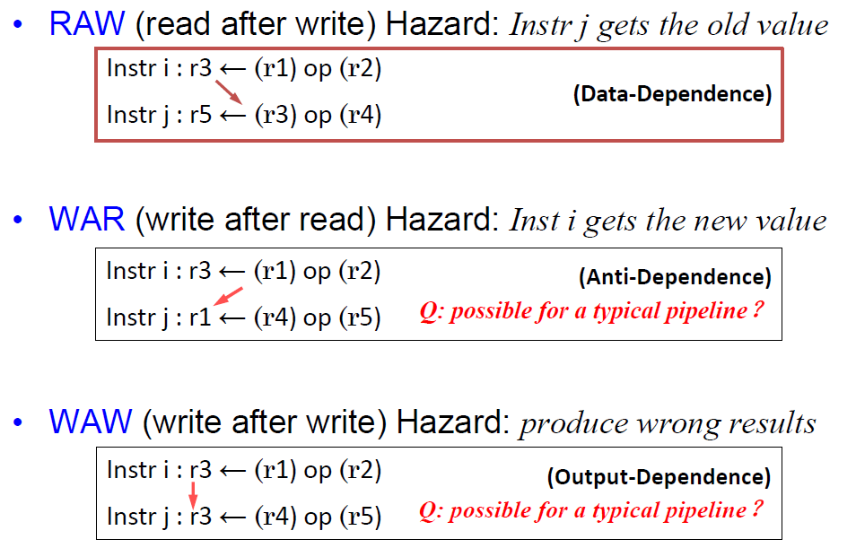

  * 三种流水线冒险：

    * **structural hazard 结构冒险**
    * **data hazard 数据冒险**：通过转发和预测来避免 bypassing or forwarding，但不能规避load/use hazard
    * **control hazard 控制冒险**

  * pipeline interlock：检测数据冒险、暂停pipeline的硬件机制称为pipeline interlock

    

* 动态调度：记分牌算法 Scoreboarding

  * 核心：out-of-order execution, control-centric

  * FU/Function unit：包括Adders, multipliers, ALUs, register files, load/store units

  * **不同类型的FUs**

  * Scoreboarding的四个阶段

    * Issue：**检查结构冒险和WAW冒险**，可能stall（如果是写同一个寄存器就不行）
      * unit是否有空闲
    * Read operands：**如果没有RAW冒险**，读取operands（如果现在要用的正在被写就要等等）
    * Execution：遵循记分牌的指示
    * Write result：**检查WAR冒险**，可能stall（如果现在要写的寄存器正在被读就要等等）
      * 是否有之前的指令读取自己目标寄存器中的值（RO阶段过后就可以了），遍历当前unit的Fi是否在其他unit的Fj，Fk中出现，并且Rj，Rk为Yes
    * 出现问题的原因就是这是基于寄存器号的，而不是tag的

    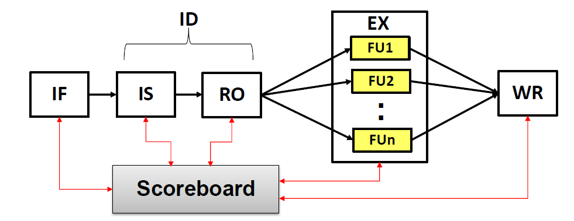

  * Scoreboarding的九个field

    * Op：unit中正在执行的操作
    * Fi：目标寄存器号
    * Fj, Fk：源寄存器号
    * Qj, Qk：产生Fj，Fk的function unit（Integer, Add等）
    * Rj, Rk：表示Fi，Fj是否ready的flag
    * Busy：表示unit是否busy

  * Scoreboarding执行界面

    * **执行时间是指在RO处停留的时间**，贴图是中途的执行截图

    

    

* 动态调度：Tomasulo‘s Algorithm

  * Tomasulo's Algorithm的要点
    * 保留站 Reservation Station
    * Load/Store Buffers
    * 公共数据总线 Common Data Bus：Data flow approach:，指令可以在操作数available的瞬间开始执行
    * 寄存器重命名 Register Renaming：指令中的寄存被tag/指向保留站的pointer代替，排除了name dependence

  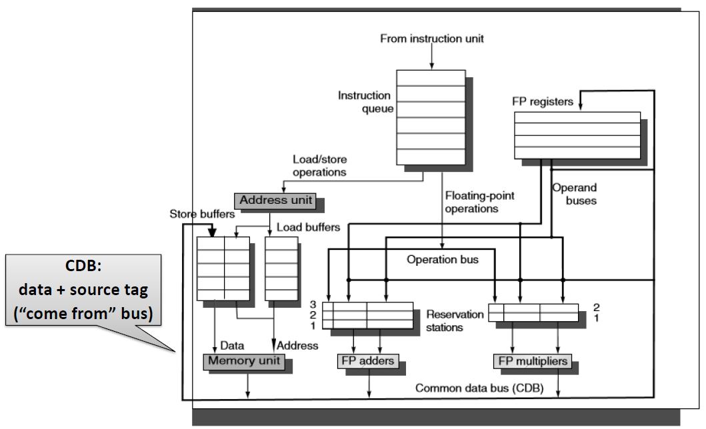

  * Tomasulo's Algorithm的三个阶段

    * Issue：从queue中获取指令（顺序）
    * Execution：执行（可能乱序）
    * Write result：结束执行，写回数据（可能乱序）

  * Tomasulo's Algorithm，保留站的field

    * Op：unit中正在执行的操作
    * Vj, Vk：源操作符的值（不是name）
    * Qj, Qk：产生Fj，Fk的RS
    * Busy：表示RS或FU是否busy

  * Tomasulo's Algorithm执行界面

    * **执行时间是指在EX处停留的时间**
    * 值在算出来存进register result status的同时更新保留站的内容

    

    

* Scoreboard 和 Tomasulo的对比

  * Tomasulo的关键特征
    * 用Reservation Stations (RS) 实现分布式控制
    * 用Common Data Bus (CDB) 广播所有结果
    * 用tags来标识数据的值
  * Tomasulo 与 scoreboard 不同的地方
    * 分布式冒险检测，用RS来控制
    * 数据结果被同时转发到function Unit, 用CDB

* Summary

  * Pipeline stall and bubble
  * Dependency and hazards
  * RAW, WAR, WAW
  * Forwarding and pipeline interlock
  * Functional units
  * Dynamic scheduling and OoO(Out-of-order execution)
  * Scoreboarding
  * Tomasulo's Algorithm

* 

------

###  第四讲 指令级并行化探索 II

* Review 
  * Hazards (data/name/control)
  * RAW, WAR, WAW hazards
  * Different types of functional units
  * Dynamic scheduling and out-of-order execution
  * Scoreboarding approach vs. Tomasulo's approach
* **标量流水线 Scalar Pipelines 的不足**

    * 定义：single pipeline with multiple stages，organized in a linear sequential order
    * **标量流水线的吞吐量存在上限**
      * 最大吞吐量是1 instr per machine cycle
      * 更深层次的pipeline的成本效益
    * **单一管道的低效统一**
      * 需要不同的硬件资源支持
      * 指令需要长/可变的延迟
    * **执行僵化rigid导致的效率问题**
      * 一个stall会影响整个流水线

* 优化标量流水线的三种思路
  * make it parallel - superscalar pipelines 超标量流水线
    * 每个machine cycle中fetch多条指令，然后并行decode
  * make it diversified
    * EX阶段提供多个异构FU，以及合适数量的混合FU
  * make it dynamic
    * 尾随的指令可以绕过stall的前置指令
    * 复杂的multi-entry buffer，用于缓冲指令

* SuperScalar Pipeline

  * 相对于scalar pipeline的性能提升：并行化的pipeline
  * 两个重要模块
    * Dispatch Buffer (DB) : 控制并行解码后的指令in order
    * Completion Buffer：控制执行结束后的指令in order

  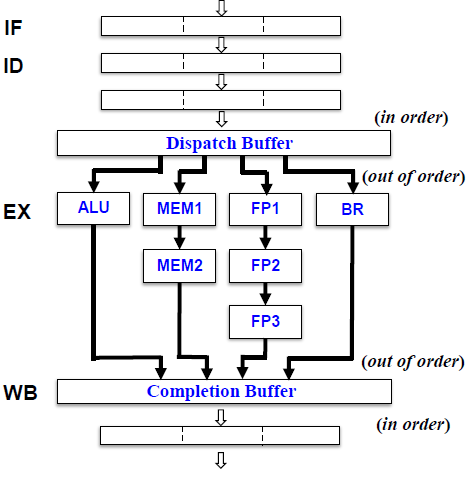

* 评价Pipeline的三个参数

  - Instruction-level parallelism required to fully utilize 利用率
  - Instruction issued per cycle (IPC) 每一时钟周期执行指令数量
  - Simple operation latency 简单指令延迟

* **不同Pipeline的性能评价，Classifying ILP Machines**

  - **Simple Scalar Pipeline ：利用率 : 1/cycle ; IPC : 1 ; latency : 1**
  - **Superscalar machine (n width) ：利用率 : n/cycle ; IPC : n ; latency : 1**
  - **Superpipelined machine (degree m) ：利用率 : m/base cycle ; IPC : 1 (cycle time : 1/m) ; latency : m**
  - **VLIW machine ：利用率 : n/cycle ; IPC : n instr/cycle (1 VLIW/cycle) ; latency : 1**

  

  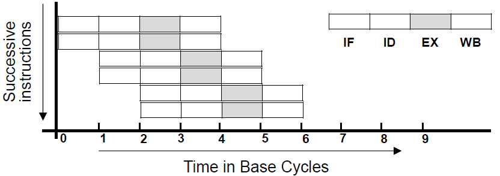

  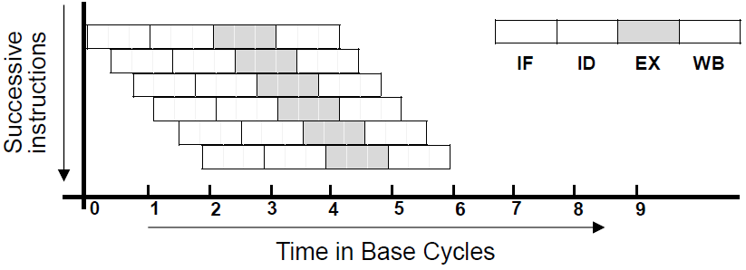

  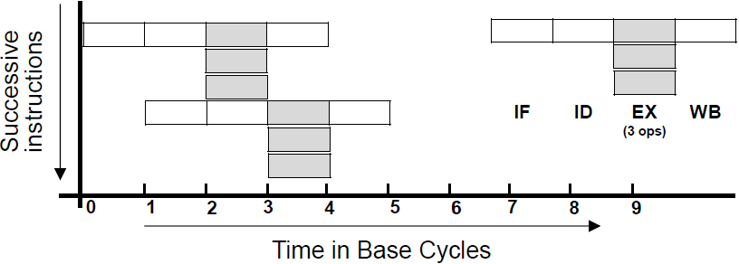

* Branch Prediction 分支预测

  * 17% 的gcc指令是带分支的
  * 两个方面的预测：Branch target speculation和Branch condition speculation
  * Static Branch Prediction 静态分支预测
    * 在编译时就预测分支的行为：预测always taken；根据分支方向预测；根据历史收集数据预测
  * Dynamic Branch Prediction
    * 根据分支的不同行为来预测：在程序整个生命周期中，可能会改变预测；硬件支持 branch history tables, branch target buffer等

* Branch History Tables 基于历史数据的预测

  * key-value设计：提取fetch PC中的一部分作为key，index是2bits的00/01/10/11

  * 效果：4K-entry的BHT，2bits一个entry，80-90%的预测正确率

  * 2bits Branch Prediction

    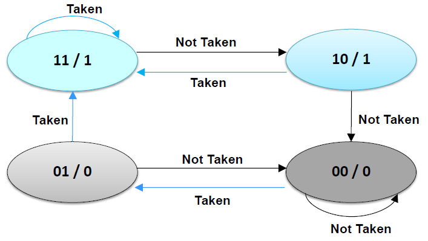

* Branch Target Buffer

  * 类似TLB的查表性质

  * BTB包括两个部分：Branch instruction address: BIA，Branch target address: BTA

    

* Mis-prediction Recovery 分支预测错误恢复

  * In-order processor：kill掉所有之后的指令
  * out-of-order processor：可能已经有之后的指令做完了
  * 相同的问题：Precise Exception
  * 潜在的安全问题：Meltdown，Spectre，利用乱序执行和分支错误进行攻击

* Hardware-based Speculation

  * 核心思想：Dynamic branch prediction, Dynamic scheduling of basic blocks, OoO execution with precise exception (in-order commit)

    * 乱序fetch，乱序complete，顺序commit（只有oldest且result valid的指令才可以提交）

  * **Reorder Buffer（ROB）**

    * Instruction type：指令类型（分支/访存/ALU）
    * Destination：写寄存器号/内存地址
    * Value

    

  * 实际案例（含原始Tomasulo对比）

    * ALU处理不含操作数的指令；Instr Q是指令队列；Reorder Buffer保证顺序commit，head是oldest；FP registers是commit，之前多了一个ROB，src表示即将写入的tag；IS/EX/WR的框实际应该还是有的

  

  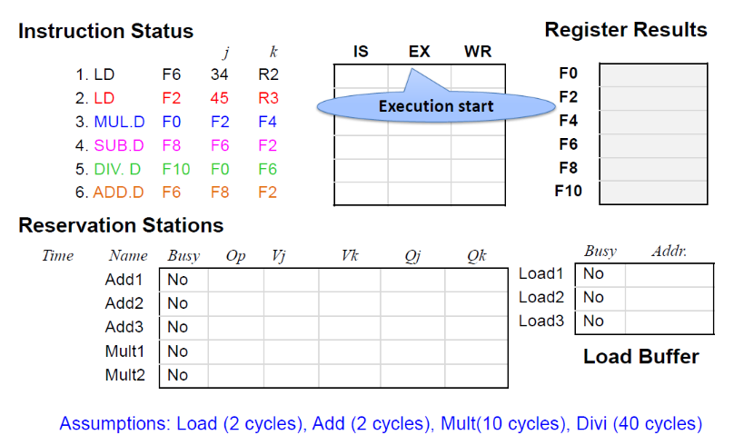

  * 实际执行表格（IS/EX/WR)
    * tag值全都填充后，下一周期开始执行
    * 如果没commit之前，register的src又改了，直接覆写（cycle 8）
    * 这里ADD/SUB周期为3，MUL周期12

  | 指令         | IS          | EX      | WR      | CM             |
  | ------------ | ----------- | ------- | ------- | -------------- |
  | l1 ADD.D     | C1          | C2      | C5      | C6             |
  | l2 MUL.D     | C2          | C5      | C17     | C18            |
  | l3 ADD.D     | C3          | C18     | C21     | C22            |
  | l4 SUB.D     | C4          | C5      | C8      | C23            |
  | l5 SUB.I     | C5          | C6      |         |                |
  | l6 BNEZ      | C6          |         |         |                |
  | ~~l1 ADD.D~~ | ~~C7~~      | ~~C8~~  | ~~C11~~ | ~~(分支错误)~~ |
  | ~~l2 MUL.D~~ | ~~C8~~      | ~~C12~~ |         |                |
  | ~~l3 ADD.D~~ | ~~(ROB满)~~ |         |         |                |

* VLIW 处理器 Very Long Instruction Word

  * 固定数量的operations被format成一条大指令，通常是3条operations
  * 目的：高性能，低硬件复杂度
    * 减少multiple-issue的硬件
    * 简单的指令调度
    * 省去结构冒险的检查逻辑

  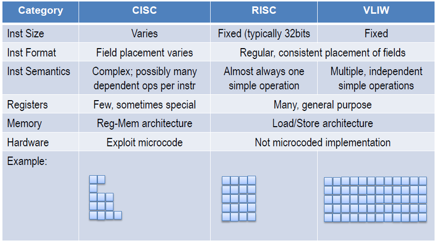

  * 调度的复杂性被转移到编译器中
    * 编译器来组成每条VLIW指令
    * 检查hazard，隐藏latency
    * 通过fill slots来优化指令
  * VLIM对于三种hazard的适应性
    * 结构冒险：不会有两条operations共用相同的FU或Memory bank
    * 数据冒险：同一个bundle的指令不存在数据毛线
    * 控制冒险：预测执行，静态分支预测
  * Loop Unrolling 循环展开：避免delay，提高CPI
  * EPIC 显示并行指令计算 Explicitly Parallel Instruction Computing
    * 提供在编译时设计plan of execution(POE) 的能力
    * 提供允许编译器"play the statistics"的特性
    * 提供与硬件交流POE的能力

* Summary

  * Superscalar Pipeline
    * Limitations of scalar processor
    * Basic feature of superscalar pipeline
    * Multi-Issue Processor
    * Dispatch Buffer and Completion Buffer
    * Classification of ILP Machines
    * Rationale理性的 of branch prediction; 2-bit prediction
  * Speculation
    * Precise exception
    * Reorder buffer (ROB)
    * Tomasulo's Algorithm with ROB
  * VLIW and EPIC
    * CISC vs RISC vs VLIM
    * Loop unrolling
    * The concept of EPIC

* 

------

### 第五讲 缓存和主存系统

* Review
  * Three limitations of simple pipeline
  * Superscalar pipeline and multiple issue 
  * Classification of ILP
  * Branch prediction and precise exception
  * Reorder buffer
  * Tomasulo algorithm with ROB
  * VLIM and loop unrolling

* Typical PC Organization 典型的PC架构

  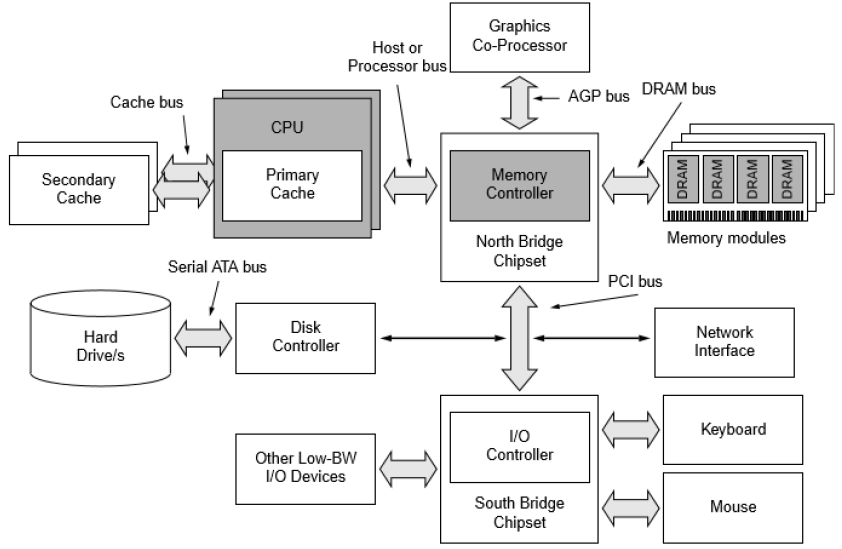

* Memory Hierarchy 存储层次

  

* About Cache

  * **Cache Concept：**这张图应该会比较重要
    * on-chip : 片上存储器；off-chip：片外存储器，记忆体，片外内存

  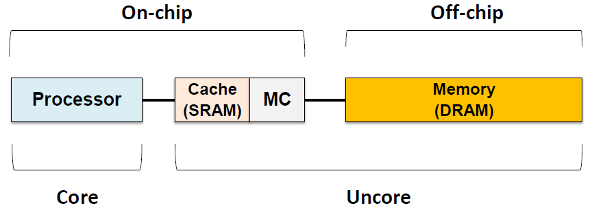

  * Cache Format

    * Cache entry fields：tag，status，data
    * 32位地址的机器，cache block大小16 B (4 words)

    

  * Cache联结方式：direct mapped 直接映射；fully associative 全相联；set associative 组相联

* About Virtual Memory

  * Page Table：将virtual pages映射到physical pages的 PTE 的序列
  * 32位地址空间，4K的page大小，4 byte的PTE
    * 需要2^32 / 2^12 =2^20个PTE
    * Page table的大小为2^22 (4MB)

  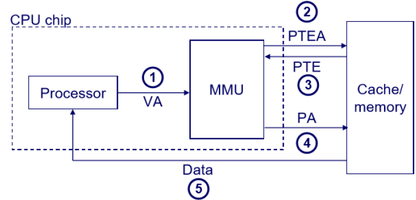

  

* Cache Optimization

  * 利用局部性：Temporal locality 时间局部性，Spatial locality 空间局部性，Algorithm locality
  * 3C model：Compulsory miss 冷不命中，Capacity miss 容量不命中，Conflict miss 冲突不命中

* Cache Optimization #1

  * **Miss Caching**
    * 定义：在L1和L2 cache中的一个全相联cache，包含2-5个cache line的数据，旨在减少conflict miss
    * 当L1 cache miss时，检查miss cache中有否有，如果有就把cache line加到L1 cache；否则就从L2 cache中获取，在L1 cache和miss cache中都存一份；L1 cache  移除某cache line时，miss cache中不移除
  * **Victim Caching**
    * 定义：修改replacement策略；比miss cache更好的地方：更小，更好的性能；即使是一两个single line也可能effective
    * 当L1 cache miss时，检查victim cache，如果有，就与L1 cache中的被移除cache line交换；否则就从L2 cache中获取

* Cache Optimization #2

  * Prefetching
    * 当可以利用时间局部性的时候，miss cache和victim cache都会很有用
    * 提前fetch内存块是有用的：预取指令；预取顺序的data access
    * 提前fetch的内存块不一定要放在L1 cache，可以另找一个special buffer；没有被CPU用过的预取块也不会evict L1 cache中可能有用的block
  * Content Management
    * Partitioning heuristics 启发式分区：决定是否cache，应该cache在哪
    * Prefetching heuristics 启发式预取：决定是否、什么时候cache预取块
    * Locality optimizations 局部性优化：重构代码，写cache-friendly的code
  * Prefetch效果的评判标准
    * Accuracy 精度：有用的预取数量/预取的总数
    * Coverage 覆盖率：有用的预取数量/没有预取时原本的总miss数
    * 结果：It depends. 不同的环境这两个数据差距很大
  * 不能无限预取的三个理由：时间，evict，带宽

* Cache Optimization #3：Cache Write Policies：

  * write cache hit：write-back和write-through（写回和直写）
  * write cache miss：write-allocate和no-write allocate
  * 在write miss时，即所要写的地址不在cache中，一种办法是把要写的内容直接写回main memory（no write allocate policy），另一种办法是把要写的地址所在的块先从main memory调入cache中，然后写cache（write allocate policy）
  * write buffer和write cache：tag-less FIFO，have tag

* Cache Relationship (Cache的水平层次)

  * inclusive 相容：每个cache item都在另一个地方有一份拷贝
  * exclusive 互斥：交集为空

* 主存中的物理架构 (Main Memory / DRAM System)

  * DIMM (dual in-line memory module) 双列直插式存储模块
  * **每个DIMM包括一个/多个独立的rank**
  * **每个rank是一组运行一致的DRAM device**
    * rank是一系列DRAM device按照给定的命令同步操作
  * **每个DRAM device包括一个/多个独立的bank**
  * **每个bank都由slaved memory arrays组成**
    * 描述了DRAM devices内部的一系列独立的memory array
  * Channel：MC和DRAM module之间的path

  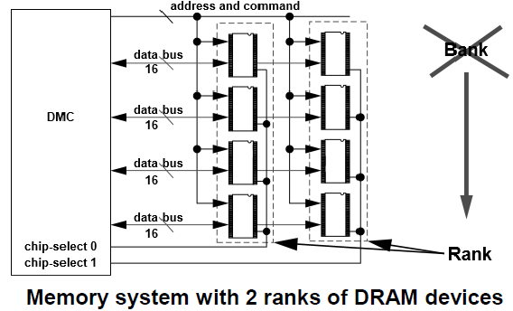

  

* Parallelism in DRAM

  * rank是一组可单独寻址的DRAM device，允许DIMM-level级的独立操作
  * 每组独立运行的memory array (DRAM device中)被称为一个bank
  * 因为有许多bank，所以可以同时执行不同的request
  * rank-level和bank-level的并发可以通过pipeline request来提供带宽

* Address Mapping (Translation)

  * **通过channel ID，rank ID，bank ID，row ID，column ID就可以定位到物理地址**
  * 连续的cache line存在同一个row，可以提高row buffer的hit rate
  * 连续的cache line存在不同的rank，可以提高并行性

  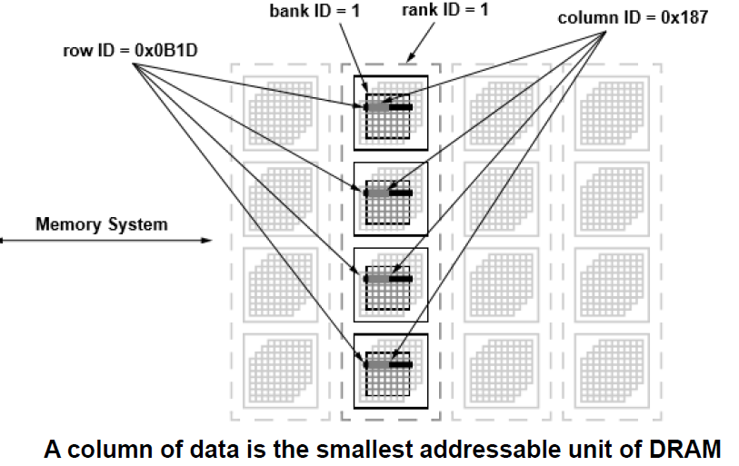

* 1T1C DRAM Cell

  * T：transistor 晶体管，C：capacitor 电容
  * A control bus is composed of the row and column strobes, clock, and other signals.

  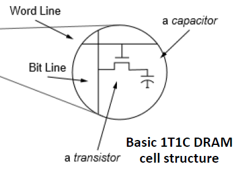

  * DRAM Array Access：Row Access Strobe (RAS)，Column Access Strobe (CAS)

* Refresh Mechanism

  * **row是bank中refresh时的最小单元**
  * 通常情况下，DRAM cell中数据的保留时间是64ms
  * Refresh操作可以在rank-level或bank-level进行

  

* Cost of Accessing DRAM

  * Row buffer hit：20 ns
  * Empty row buffer access：40 ns
  * Row buffer conflict：60 ns

* 同步和异步的device

  * 同步DRAM (SDRAM)：用时钟取代RAS和CAS，从而获得更高数据传输率
  * Double Data Rate (DDR) SDRAM：数据在时钟的两端传输

  

* Memory Wall and Memory Bandwidth Wall

  * 由于CPU的主频已经不再无限提高了，我们现在撞上了内存的带宽墙
  * DRAM的容量没两年翻一番，但latency没怎么提升
  * Power wall：数据中心25-40%的power是提供给DRAM system
  * 如果提升row buffer hit rate，那latency和power都可以被优化，这需要智能的data row mapping和智能的request schedule

* MLP (Multi-Layer Perception) ：多层感知器，是一种前向结构的人工神经网络，映射一组输入向量到一组输出向量

* Summary

  * Memory hierarchy, uncore and off-chip
  * Cache line, block, address
  * Virtual memory, page table, PTE, TLB
  * Locality principle, Inclusive and exclusive relationship
  * Miss caching, victim caching, prefetching
  * Cache write policies, write buffer/cache
  * rank, bank, array, channel, MC, parallelism in DRAM
  * 1T1C DRAM cell, data access, DRAM refresh
  * DRAM access cost, synchronous/asynchronous design
  * Memory design challenges, memory wall, MLP

*  

------

