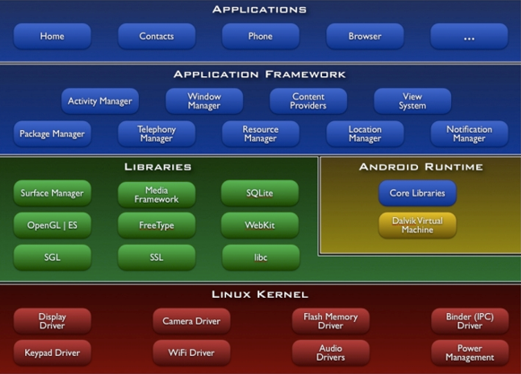
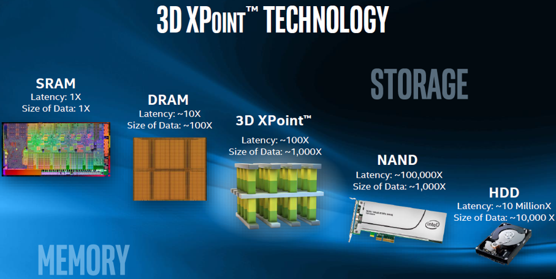
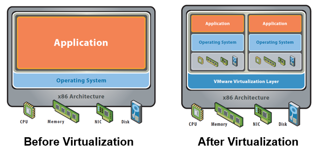
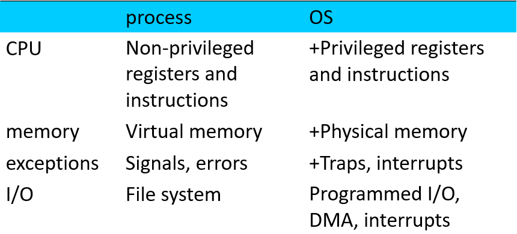

## 操作系统

------

### 第一讲 Introduction & 8 Important Problems in Modern Operating Systems

* 操作系统是什么
  * 定义：操作系统是管理硬件资源、控制程序运行、改善人机界面和为应用软件提供支持的一种系统软件；向上提供服务，向下管理资源
    * OS对apps管理和隐藏资源，隐藏tedious/complex的底层细节，为apps提供执行环境
  * 广义定义：包括管理程序，操作系统，运行时环境

* 操作系统发展的两个观点
  * 硬件与应用蓬勃发展，在端和数据中心侧可能孕育新的操作系统
  * 传统操作系统如Linux进入架构稳定期，难以根本上适应新硬件与应用需求

* 8 Important Problems of OS

  * Scale Up；Security & Trustworthy；Energy Efficiency；Mobility；
  * Write Correct (Parallel) Code；Scale out；Non-Volatile Storage；Virtualization

* Issue 1 ：Scale Up (Performance Scalability) 纵向扩展

  * Challenge 1：make software performance follow Moore's Law
  * Andy-Bill’s Law：安迪指英特尔前CEO安迪·格鲁夫，比尔指微软前任CEO比尔·盖茨，这句话的意思是，硬件提高的性能，很快被软件消耗掉了。
  * Scalability 扩展性
    * 理论上应用在多核(N)上运行应该比单核快N倍
    * 但实际上受限于Amdahl's Law (Lock，共享数据结构，共享硬件DRAM/NIC)
  * Scale Up OS
    * 对用户apps提供更好的抽象
    * 消除不可扩展的同步
    * 最小化共享数据结构
    * 跨过memory wall

* Issue 2 ：Security & Trustworthy 安全问题

  * Meltdown和Spectre攻击：利用分支预测和乱序执行的漏洞
  * KPTI (Kernel Page Table Isolation)，内核页表隔离来预防meltdown攻击
  * Formal verification 形式化验证 (seL4)，针对Trustworthy问题

* Issue 3 ：Power Efficiency 能源效率

  * 典型服务器各组件的耗电情况

    

  * 关于Power，OS可以做的事

    * 动态电压、频率适应：根据overload来调整CPU的主频
    * 关闭设备来省电：disk，LCD 液晶显示器，memory
    * 问题：能源消耗是不随overload的增加而增加的 (Static power, leakage power)
    * Threshold Voltage 阈值/临界电压

* Issue 4 ：Mobility 移动性

  * 智能手机的操作系统：Symbian，Windows Mobile，RIM Blackberry OS，Apple iOS，Google Android，Palm WebOS，Windows Phone 7

  * Android操作系统的架构

    

  * 移动端OS的特殊性

    * 更高的能源利用效率；更丰富的用户体验；更有限的资源；更严峻的安全问题 (更多的user data存在OS中)

* Issue 5 ：Write Correct Parallel Code 正确的并发代码

  * Parallel Code的难点
    * 并发程序容易出现并发错误
    * 并发bug的特点：不确定性，难以复现/debug
  * 解决问题的方法
    * 并发错误检测：race detection, atomicity violation detection, deadlock bug detection
    * 并发程序测试：详尽的测试，不同的涵盖范围准则
    * 并发编程语言/模型设计：transactional memory
  * 关于并发，OS可以做的事
    * 减少资源的不确定性
    * 容忍应用的bug
    * 忠实地捕获并发bug并进行复制
    * 提供更好的编程接口来简化编程

* Issue 6 ：Scale Out  (use distributed systems) 横向扩展

  * 分布式系统需要解决的问题
    * Ease-of-use：解决地理隔离；给用户/应用提供位置透明性
    * Availability：用一些unreliable的组件构建reliable的系统
    * Scalable capacity：聚合许多computer的资源
    * Modular functionality：只需要构建能完成single task的service就行
  * Scale Out的挑战
    * System Design 系统设计：interface，abstraction
    * Consistency 一致性
    * Fault Tolerance 容错
    * Different deployment scenarios 不同的部署场景：Clusters, wide area distribution, sensor network
    * Security 安全：authenticate clients/servers，defend misbehaving server
    * Implementation 实现：bottleneck

* Issue 7 ：Non-Volatile Storage 非易失性内存

  * 新式的存储

    

  * 关于存储，OS可以做的事

    * 适应新的存储模型
    * 非易失性内存会改变OS的管理存储资源的方式
    * 提供更好的IO performance

* Issue 8 ：Virtualization 虚拟化

  * 虚拟化架构

    

  * 虚拟化的优势

    * 最大化资源利用率：多个操作系统环境可以共存于同一台计算机上，彼此隔离；server consolidation
    * 容错：fault and migrate
    * 轻便：可以使用各种OS
    * 易于管理

  * 虚拟化的方法

    

*  

------

### 第二讲