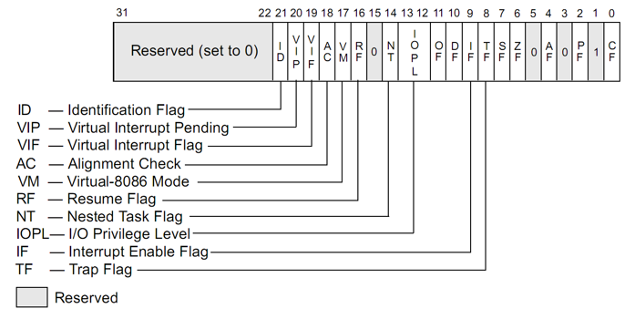
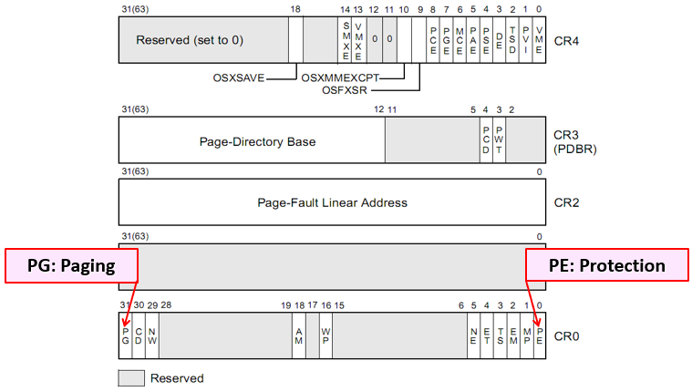
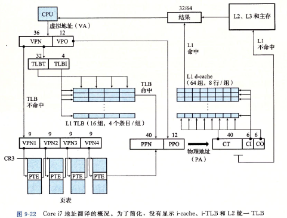

## 操作系统

------

### 第一讲 Introduction & 8 Important Problems in Modern Operating Systems

* 操作系统是什么
  * 定义：操作系统是管理硬件资源、控制程序运行、改善人机界面和为应用软件提供支持的一种系统软件；向上提供服务，向下管理资源
    * OS对apps管理和隐藏资源，隐藏tedious/complex的底层细节，为apps提供执行环境
  * 广义定义：包括管理程序，操作系统，运行时环境

* 操作系统发展的两个观点
  * 硬件与应用蓬勃发展，在端和数据中心侧可能孕育新的操作系统
  * 传统操作系统如Linux进入架构稳定期，难以根本上适应新硬件与应用需求

* 8 Important Problems of OS

  * Scale Up；Security & Trustworthy；Energy Efficiency；Mobility；
  * Write Correct (Parallel) Code；Scale out；Non-Volatile Storage；Virtualization

* Issue 1 ：Scale Up (Performance Scalability) 纵向扩展

  * Challenge 1：make software performance follow Moore's Law
  * Andy-Bill’s Law：安迪指英特尔前CEO安迪·格鲁夫，比尔指微软前任CEO比尔·盖茨，这句话的意思是，硬件提高的性能，很快被软件消耗掉了。
  * Scalability 扩展性
    * 理论上应用在多核(N)上运行应该比单核快N倍
    * 但实际上受限于Amdahl's Law (Lock，共享数据结构，共享硬件DRAM/NIC)
  * Scale Up OS
    * 对用户apps提供更好的抽象
    * 消除不可扩展的同步
    * 最小化共享数据结构
    * 跨过memory wall

* Issue 2 ：Security & Trustworthy 安全问题

  * Meltdown和Spectre攻击：利用分支预测和乱序执行的漏洞
  * KPTI (Kernel Page Table Isolation)，内核页表隔离来预防meltdown攻击
  * Formal verification 形式化验证 (seL4)，针对Trustworthy问题

* Issue 3 ：Power Efficiency 能源效率

  * 典型服务器各组件的耗电情况

    

  * 关于Power，OS可以做的事

    * 动态电压、频率适应：根据overload来调整CPU的主频
    * 关闭设备来省电：disk，LCD 液晶显示器，memory
    * 问题：能源消耗是不随overload的增加而增加的 (Static power, leakage power)
    * Threshold Voltage 阈值/临界电压

* Issue 4 ：Mobility 移动性

  * 智能手机的操作系统：Symbian，Windows Mobile，RIM Blackberry OS，Apple iOS，Google Android，Palm WebOS，Windows Phone 7

  * Android操作系统的架构

    

  * 移动端OS的特殊性

    * 更高的能源利用效率；更丰富的用户体验；更有限的资源；更严峻的安全问题 (更多的user data存在OS中)

* Issue 5 ：Write Correct Parallel Code 正确的并发代码

  * Parallel Code的难点
    * 并发程序容易出现并发错误
    * 并发bug的特点：不确定性，难以复现/debug
  * 解决问题的方法
    * 并发错误检测：race detection, atomicity violation detection, deadlock bug detection
    * 并发程序测试：详尽的测试，不同的涵盖范围准则
    * 并发编程语言/模型设计：transactional memory
  * 关于并发，OS可以做的事
    * 减少资源的不确定性
    * 容忍应用的bug
    * 忠实地捕获并发bug并进行复制
    * 提供更好的编程接口来简化编程

* Issue 6 ：Scale Out  (use distributed systems) 横向扩展

  * 分布式系统需要解决的问题
    * Ease-of-use：解决地理隔离；给用户/应用提供位置透明性
    * Availability：用一些unreliable的组件构建reliable的系统
    * Scalable capacity：聚合许多computer的资源
    * Modular functionality：只需要构建能完成single task的service就行
  * Scale Out的挑战
    * System Design 系统设计：interface，abstraction
    * Consistency 一致性
    * Fault Tolerance 容错
    * Different deployment scenarios 不同的部署场景：Clusters, wide area distribution, sensor network
    * Security 安全：authenticate clients/servers，defend misbehaving server
    * Implementation 实现：bottleneck

* Issue 7 ：Non-Volatile Storage 非易失性内存

  * 新式的存储

    

  * 关于存储，OS可以做的事

    * 适应新的存储模型
    * 非易失性内存会改变OS的管理存储资源的方式
    * 提供更好的IO performance

* Issue 8 ：Virtualization 虚拟化

  * 虚拟化架构

    

  * 虚拟化的优势

    * 最大化资源利用率：多个操作系统环境可以共存于同一台计算机上，彼此隔离；server consolidation
    * 容错：fault and migrate
    * 轻便：可以使用各种OS
    * 易于管理

  * 虚拟化的方法

    

*  

------

### 第二讲 OS Structures

* OS Design and Implementation

  * Worse is Better design 设计原则
  * User goal 和 System goal
    * 用户会希望操作系统方便使用，容易学，可靠，安全，还快
    * 系统开发者希望操作系统容易设计/实现，可靠，可扩展，容错，高效

* Kernel 分类：Monolithic, Microkernel, Exokernel, Hybrid

  * Monolithic 宏内核：OS在kernel space运行，在supervisor mode 运行 （Linux BSD)
  * Microkernel 微内核：low-level address space management, thread management, and inter-process communication (IPC)等技术，（Mach  L4 kernel）
  * Hybrid kernel 复合内核：Windows ，NT kernel

  
  * DOS：没有模块的划分，接口和实现没有很好的分离。DOS以后开始有一些Layered Approach，将OS分为若干level来实现

  

  * UNIX：UNIX OS包括System program和kernel部分

   

* Microkernel 系统架构

  * 思想：将尽可能多的功能从kernel态移到user态
  * 优势：易于扩展；易于将OS移植到其他体系结构；因为kernel代码更少，所以更可靠，更安全
  * 缺点：kernel和user之间频繁通信的overhead

  

* 微内核相较于宏内核的改变

  * Task and thread management
  * Interprocess communication
  * Memory object management
    * 主要是virtual memory
  * System call redirection
    * 通过trap来切换mode；
  * Device support
  * User multiprocessing
  * Multicomputer support

* L3 - > L4

* 暂时鸽一会

*  

------

### 第三讲 PC Programming & Booting

* x86架构 (32-bit)
  * EIP随着指令增加；指令是不定长的；EIP会被call, ret, jmp, cond. jmp修改

##### 五种CPU工作模式 (modes) {

* 定义：Real Mode, Protected Mode, Virtual-8086 Mode, IA-32e Mode, System Management Mode
* 名词解释：
  * PE，Protection Mode的开关
  * SMI，System Management Interrupt，系统管理中断，使系统进入SMM的特殊中断
  * SCI，System Control Interrupt，系统控制中断，专门用于ACPI电源管理的一个IRQ，需要OS支持
* Real-Address Mode是在bootloader阶段的运行模式，存在时间很短。内存寻址方式和8086相同，没有虚拟地址，由16位段寄存器（CS/SS/DS/ES）乘以0x10当做基地址，再加上16位偏移地址形成20位的物理地址，最大寻址空间1MB，最大分段64KB。
* Protected Mode是最常用的模式，内存寻址采用32位段和偏移量（现在64位），最大寻址4GB，最大分段4GB。它提供了一些增强多工和系统稳定性的设计，比如内存保护，分页系统，虚拟内存等，防止程序随意访问地址，也拥有更大的内存访问空间。
* Virtual-8086 Mode是在保护模式下运行的虚拟实模式环境，寻址方式与实模式相同。
* IA-32e Mode是64位操作系统运行的模式，具有兼容模式和64位模式两种子模式。兼容模式可以运行在32位兼容环境，但不能运行虚拟8086程序；64位模式则完全处理64位指令
* System Management Mode有独立于OS的地址空间，用来执行电源管理或系统安全方面的指令。


##### }

##### x86中的EFLAGS寄存器  {

```
ID: Identifiction Flag - 程序能够设置或清除这个标志指示了处理器对CPUID指令的支持
VIP: Virtual Interrupt Pending - 该位置1以指示一个中断正在被挂起，当没有中断挂起时该位清零
VIF: Virtual Interrupt Flag - 使用这个标志以及VIP标志，并设置CR4控制寄存器中的VME标志就可以允许虚拟模式扩展(virtual mode extensions)
AC: Alignment Check - 该标志以及在CR0寄存器中的AM位置1时将允许内存引用的对齐检查，以上两个标志中至少有一个被清零则禁用对齐检查
VM: Virtual-8086 Mode - 置1以允许虚拟8086模式，清除则返回保护模式
RF: Resume Flag - 控制处理器对调试异常的响应
NT: Nested Task Flag - 这个标志控制中断链和被调用任务。若当前任务与前一个执行任务相关则置1，反之则清零
IOPL: I/O Privilege Level - 指示当前运行任务的I/O特权级，正在运行任务的当前特权级(CPL)必须小于或等于I/O特权级才能允许访问I/O地址空间
IF: Interrupt Enable Flag - 该标志用于控制处理器对可屏蔽中断请求的响应。置1以响应可屏蔽中断，反之则禁止可屏蔽中断
TF: Trap Flag - 将该位设置为1以允许单步调试模式，清零则禁用该模式
```



##### }

##### 控制寄存器 Control Register { 

* CR0中含有控制处理器操作模式和状态的系统控制标志；CR1保留不用；CR2含有导致页错误的线性地址；CR3中含有页目录表物理内存基地址，因此该寄存器也被称为页目录基地址寄存器PDBR（Page-Directory Base address Register）



##### } 

##### 内存管理寄存器 Memory-Management Register {

* 段选择符：32位汇编中16位段寄存器(CS、DS、ES、SS、FS、GS)中不再存放段基址,而 是段描述符在段描述符表中的索引值,D3-D15位是索引值,D0-D1位是优先级(RPL)用于特权检查,D2位是描述符表引用指示位TI,TI=0指 示从全局描述表GDT中读取描述符，TI=1指示从局部描述符中LDT中读取描述符。这些信息总称段选择符(段选择子)


* 段描述符表：IA-32处理器把所有段描述符按顺序组织成线性表放在内存中，称为段描述符表。分为三类：全局描述符表GDT，局部描述符表LDT和中断描述符表IDT。GDT和IDT在整个系统中只有一张，而每个任务 都有自己私有的一张局部描述符表LDT，用于记录本任务中涉及的各个代码段、数据段和堆栈段以及本任务的使用的门描述符。GDT包含系统使用的代码段、数据段、堆栈段和特殊数据段描述符，以及所有任务局部描述符表LDT的描述符


##### }

##### 内存寻址模型 Memory Model {

* 8086寻址适用于16位微处理器，在Real-Address Mode时使用，没有虚拟地址，最大寻址空间64KB。
* External address寻址由16位段寄存器（CS/SS/DS/ES）乘以0x10当做基地址，再加上16位offset形成20位的物理地址，最大寻址空间1MB。
* 80386寻址适用于32位数据和总线地址，在Protected Mode时使用，存在虚拟地址到物理地址的映射关系，有分页系统，最大寻址空间4GB。

* Physical Address Space Layout
  * 1MB以上被称为extended memory；640KB-1MB是一个内存空洞


##### }

##### xv6源码分析 bootasm.S, bootmain.c, entry.S {

* BIOS会将磁盘的第一个扇区load到物理地址0x7c00，并以real mode开始执行
* Intel 8088的地址线只有20根 (A0~A19)，当时计算机的 RAM 只有几百 KB 或不到 1MB 时，20 根地址线已足够用来寻址；其所能寻址的最高地址是0xffff : 0xffff，即0x10ffef，对于超出0x100000 (1MB)的寻址地址，将默认回卷到0x0ffef
* 在机器启动时，默认条件下，A20 地址线是禁止的，所以操作系统必须使用适当的方法来开启它。但是由于各种兼容机所使用的芯片集不同，有键盘控制器，端口0x92，INT 15中断，0xee端口等方法 <refs https://blog.csdn.net/longintchar/article/details/79365928>
* 从实模式进入保护模式：置上CR0的PE位；用ljmp重载cs和eip

```assembly
ljmp    $(SEG_KCODE<<3), $start32
```

* readsect(...) 中用到的I/O端口

```
1F0H　　 0号硬盘数据寄存器 
1F1H　　 0号硬盘错误寄存器 
1F2H　　 0号硬盘数据扇区计数 
1F3H　　 0号硬盘扇区数 
1F4H　　 0号硬盘柱面（低字节） 
1F5H　　 0号硬盘柱面（高字节） 
1F6H　　 0号硬盘驱动器/磁头寄存器 
1F7H　　 0号硬盘状态寄存器 
```

* 在entry.S中，cr4打开PSE大页，cr3设置entrypgdir基地址，cr0置上PG位和WP位
* TODO： 补充一下 实模式到保护模式，开启页表 前后的微操

##### }

* 仿真 PC Emulation：用于OS test和debug；能提高利用率
*  

------

### 第四讲 Memory init：xv6 & VM

* Core i7的内存结构



* 页表项结构 PTE


```
P: present
R/W: readable / writable
U/S: user / supervisor
WT: write-through (1) / write-back (0) - 写策略：写穿和写回
CD: cache disabled - 该页是否能被放到cache中，有些页可能是外部设备DMA修改的，不能放在cache中 
A: accessed (set by CPU, clear by OS)
D: dirty
PAT: page table attribute index
G: global page (no TLB updating on the address if CR3 is reset) - 一直放在TLB中不会被刷掉的页；比如处理page fault的handler所在的页
```

* 页目录项结构 PDE


```
PS: page size (0=4KB, 1=4MB) - 4MB: super page
大页对data-intensive的workload更好，能减少TLB miss，降低地址翻译的平均时间；小页对CPU-intensive的workload更好，内存使用更精致
```

* PAE：Physical Address Extension
  * x86和x86-64处理器的一个特色，即如果操作系统提供适当支持，则可以在32位的系统中使用超过4G的内存
  * x86的处理器增加了额外的地址线以选择那些增加了的内存地址，所以支持的内存寻址大小从32bit增加到36bit。最大支持内存由4G增加到64G，32位的虚拟地址则没有变，所以一般的应用软件可以继续使用地址为32位的指令
  * 4种页表结构（32bit机器）：未启用PAE, 4 KB的页；未启用PAE, 4 MB的页；启用PAE, 4 KB的页；启用PAE, 2MB的页

##### xv6源码分析 main.c, vm.c {

* 调用顺序：
  * (main.c) main() 
  * -> (vm.c) void kvmalloc() 
  * -> pde_t *setupkvm()，给kernel段申请页表，并做最基本的映射
    * -> int mappages(pde_t *pgdir, void *va, uint size, uint pa, int perm)，对将pa映射到va的size大小perm权限的页，为其创建一个PTE；va和size可能并不是page-align的
    * -> pte_t *walkpgdir(pde_t *pgdir, const void *va, int alloc)，返回va处的PTE，如果alloc不为0就创建一个
  * -> void switchkvm()，通过lcr3切换到kernel页表
  * -> (proc.c) void userinit()，配置第一个用户进程
* 结构体kmap
  * 每个进程只有一个page table，加上CPU不运行任何process时使用的页表(kpgdir)
  * kernel在system call和interrupt期间会直接只用当前进程的页表
  * 页的protection位防止用户代码使用内核的映射

```c++
static struct kmap {
  void *virt;
  uint phys_start;	
  uint phys_end;
  int perm;
} kmap[] = {
 { (void*)KERNBASE, 0,             EXTMEM,    PTE_W}, // I/O space
 { (void*)KERNLINK, V2P(KERNLINK), V2P(data), 0},     // kern text+rodata
 { (void*)data,     V2P(data),     PHYSTOP,   PTE_W}, // kern data+memory
 { (void*)DEVSPACE, DEVSPACE,      0,         PTE_W}, // more devices
};
```

* User VM 映射的接口

```
创建进程：Inituvm : initialized user VM
	Loaduvm: load program segment
上下文切换：switchuvm
增加/减少/释放VM：allocuvm，deallocuvm，freeuvm
Fork：copyuvm
```

##### }

------

### 第五讲 Process

* 逻辑地址 - 线性地址 - 物理地址的转换

  

  

* Boot阶段的主要工作：

  * 进入Protected Mode，开启Segment，配置GDT (ljmp指令)
  * 打开页表 (CR0_PG)，初始化entrypgdir，将kernel映射到高地址和低地址 (0x80100000, 0x100000)

* 一些概念

  * Process：设计进程的出发点：程序比处理器多；程序并不需要持续占用处理器；因此可以在不用的时候释放资源；进程是资源分配的最小单位，拥有一个地址空间和若干线程；包含program counter, stack, data section等数据块

  * Thread：线程的抽象定义：停止活动并在稍后某个 时刻恢复活动所需要的最小状态，通常是一些程序寄存器；线程是程序运行的最小单位

  * Context：xv6中的数据结构，包含edi、esi、ebx、ebp、eip五个field

  * Address spaces：地址空间，原则上和线程是独立的概念；可以在同一个地址空间从一个线程切换到另一个线程；也可以在不同地址空间切换

  * Process State：进程状态，一般有new，running，waiting，ready，terminated；xv6中为UNUSED, EMBRYO胚胎, SLEEPING, RUNNABLE, RUNNING, ZOMBIE

    * ENBRYO可以理解为到RUNNABLE之前的一个过渡。allocproc会在进程表中找到一个标记为UNUSED的位置。当它找到这样一个没有被使用的位置后，allocproc将其状态设置为EMBRYO，使其标记为被使用并给这个进程一个独有的pid。接下来，它尝试为进程的内核线程分配内核栈。如果分配失败了，allocproc会把这个位置的状态恢复为UNUSED并返回0来标记失败。

    

* Process Control Block，PCB

  * 每个process都会有一个PCB，内容包括Process state, Process counter, CPU registers, CPU scheduling information, Memory management information, Accounting information, I/O status information
  * xv6 中的进程数据结构

  

* Context Switch 上下文切换

  * 调用syscall触发中断 - save当前进程的PCB - reload目标进程的PCB - 继续执行
  * 上下文切换需要保存的内容应该是存在进程对应的kernel stack中的
  * 上下文切换换栈的瞬间

  

* Process Scheduling Queue 进程调度队列

  * Job Queue：系统中所有的process
  * Ready Queue：系统中所有等待执行的process
  * Device Queue：系统中所有等待IO设备的process

* 两种Scheduler
  * Long-term scheduler / job scheduler：调度即将进入ready queue的进程，完成时间在秒/分钟级别，决定了multiprogramming的程度
  * Short-term scheduler / CPU scheduler：调度即将执行的进程，完成时间在微秒级别
  * scheduler对process的分类：IO-bound process和CPU-bound process

* Process的创建：fork，一次执行两次返回；execute，一次执行没有返回；奇妙的机制

  

*  

------

### 第六讲 IPC 

* Review Questions
  
  * TODO
  
* Threading Model

  

* Process cooperation的优点：information sharing, computation speed-up, modularity, convenience

* IPC的两种模型：如上图，message passing 和 shared memory

  

* xv6中实现IPC的数据结构：struct pipe

  

* IPC - Message Passing

  * 不依赖共享变量的进程间交流方式，提供send和receive两种接口
  * physical comminication link：shared memory，hardware bus
  * logical communication link：logical properties

* Direct Communication

  * 接口：每个进程显示的调用send(P, message), receive(Q, message)
  * Communication link的实现细节：link是自动构建的；link和pair of process是一对一的；link可能是单向的unidirectional，但通常是双向的bidirectional

* Indirect Communication

  * 进程通过mailbox (port) 定位和接受message；每个maibox都有id，只有相互共享mailbox的进程才可以互相通信
  * 接口：每个进程通过mailbox中转通信，send(A, message), receive(A, message)
  * Communication link的实现细节：link仅当进程共享mailbox时才构建；link和pair of process是多对多的；link可以是单向的，也可以是双向的 
  * <Problem> P1/P2/P3共享mailbox A，P1 send，P2/P3 receive，谁收到？
    * 解决方法：link至多连接两个process；只允许同时一个process做receive；允许显示指定receiver

* 同步/异步消息
  * 同步消息 synchronous：block sender直到返回，block receiver直到收到消息
  * 异步消息 asynchronous：sender和receiver都不做block
* Buffering的实现有三种模式：Zero capacity (sender一直等待)，bounded capacity (当link被占满后sender等待)，unbounded capacity (无限长，sender不等待)

##### LRPC - Lightweight Remote Procedure Call

* Unix IPC 的方式：
  * 管道 pipes，信号 signals，Unix-domain sockets (用于同一主机)
  * 信号量 POSIX semaphores，FIFOS nmaed piped，共享内存 Shared memory segments，POSIX message queues
  * System V semaphore sets, System V message queues
* Unix IPC的问题
  * 比较重量级 heavyweight
  * 通常会使用polling

* Lightweight RPC Basic concepts
  * 简单的控制传输：client线程在server domain执行
  * 简单的数据传输：共享参数栈，增加寄存器
  * 简单的stub：highly optimized marshalling
  * 并发性设计：避免共享数据结构
  * 统计性结果：大多数message都比较短，几百byte的占到90%+
* IPC之前设计高开销的地方
  * stub会复制大量数据
  * message buffer会通过内核复制内容，4次
  * 访问验证
  * 消息传输 (队列)
  * scheduling，程序员看到线程跨域，系统实际上在不同的域中汇合两个线程
  * context switch，2次
  * dispatch，找一个接收线程来interpret消息，然后分派另一个线程，或者让另一个线程等待更多消息
* LRPC Binding：connection setup phase
  * 为调用接口中的每个procedure在内核中注册过程描述符(PDs)
  * 对于每个PD，参数栈(A‐stack)都在两个域中预先分配和映射读/写
  * 内核预先分配linkage record，以便从A‐stack返回
  * 将A‐stack列表作为绑定对象返回给客户端

* client thread上的调用顺序

  

*  

------

#### 第七讲 Exception

* Review

  * 两种IPC模型：shared memory，message passing
  * POSIX中的IPC方式：pipe，message passing，signal，shared memory，semaphore，etc.

* 辨析：Exception，Interrupt，System call

  * Exception：一种非法程序操作
  * Interrupt：由硬件设备产生的信号
  * System call：用户程序可以请求OS操作

* Intel CPU上的Exception簇

  

* IDT / Trap Vector in xv6

  * IDT是exception table的别称；有256个entry，每个entry都是handler；在处理相对应的interrupt时，需要给出 %cs 和 %eip
  * 可以通过 `int n` 调用System call

* 